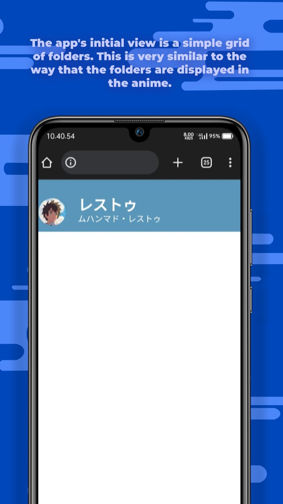
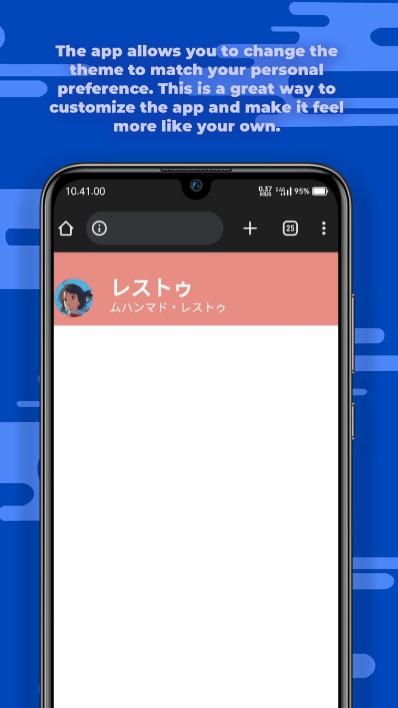
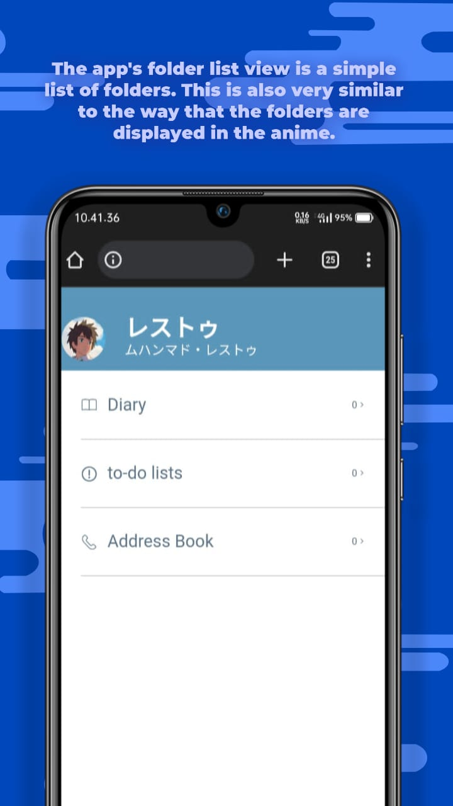
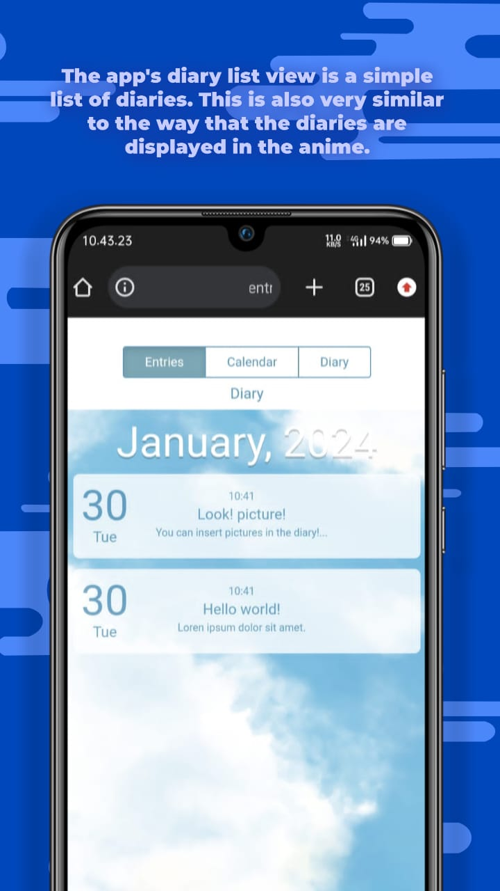
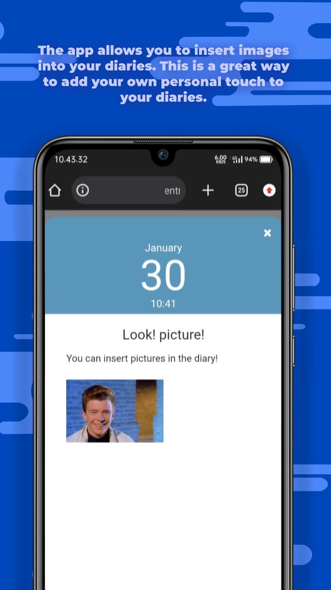

# MyDiary
MyDiary is a website inspired by the anime [Kimi no Na wa (Your Name)](https://myanimelist.net/xxx), sharing a 90% similarity. Leveraging IndexDB storage, it provides a unique experience. The original codebase was crafted by [ssshooter](https://github.com/ssshooter/MyDiary/), and I have contributed by fixing bugs and implementing updates.


## Features
- Diary Entry: Capture and store your personal thoughts and experiences.
- Contacts: Manage and save your important contacts.
- Todo List: Organize your tasks with a convenient to-do list.
- Photo Integration: Enhance your diary entries by including photos.
- Backup and Restore: Safeguard your data with JSON file backup and restore functionality (shake your device on the main page to trigger the popup).
- Theme Customization: Personalize your experience by changing the theme.
- And more: Explore additional features for an enriched diary-keeping experience.

Feel free to contribute and make MyDiary even better for users everywhere.```

## App/web preview






